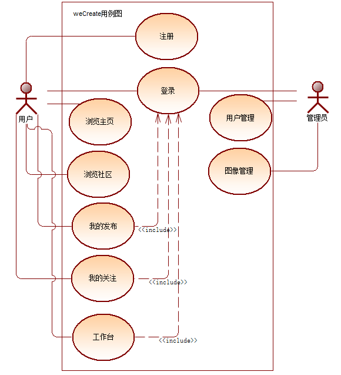

# WeCreate前端项目
weCreate项目是一个前后端分离的AI画图商用平台。在该平台，用户可以有偿下载AI绘制图片，发布悬赏任务，浏览创作社区，并且可以接收悬赏任务，使用工作台功能，创作属于自己的AI图片。
1. 在主页浏览一些图片 图片依赖于主题存在
2. 在在社区保存了所有的主题帖 可以创造图片 并发布在其之上
3. 在我的发布发布社区主题帖
4. 在我的关注 可以查看搜藏的主题帖 
5. 下载附加在主题帖的无水印图片 需要money
6. 工作台制作图片 链接后端提供的 stable difussion接口
7. 登录后 可以在个人信息处查看自己的图片库
8. 所有排行榜和主页搜索 都以图片为单位 而非帖子为单位

\
本项目是weCreate前端部分

## 目录说明
    bin 启动文件目录
    conf 配置文件目录
    controllers 前端路由配置文件目录
    models 数据传输对象目录
    services 前后端路由转发文件路径
    static 静态资源
    utils 通用函数文件
    views 页面文件目录

## 用例图

## 登录
前端 -> 账号 密码->前端gin ->转发后端 -> 验证登录信息 -> 返回cookie (MD5(uid + 超时时间 + 后台设置后缀)) -> 此时为登录状态

## 注册
前端 -> 账号 密码->前端gin ->转发后端 -> 验证注册信息 -> 返回结果

## 主页
前端 -> get 排行榜1 / 2 get 上方 下方图片 get 轮播图内容 get 右侧广告 get 筛选条件 get 发布内容 